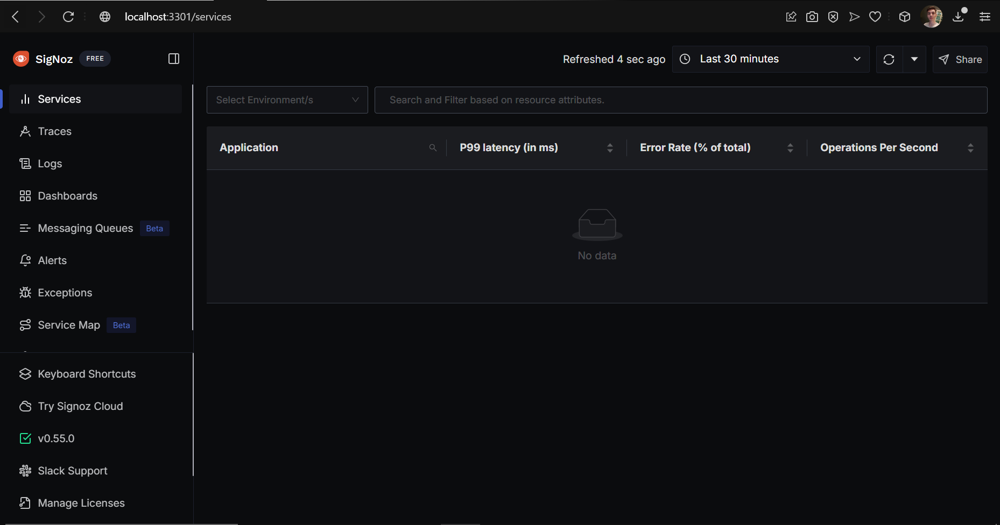

# Instrumentação de aplicações com OpenTelemetry

Nesta atividade, segui um tutorial para aprender como implementar o SigNoz em uma aplicação Golang.

Foi necessária a utilização do Docker, seguindo outro link de tutorial: 

https://signoz.io/docs/install/docker/

Desta forma, o SigNoz ficou aberto na url http://localhost:3301/ .

## Execução:

Imagem 1: Execução do SigNoz.

Imagem 2: Obtive erro na execução do banco de dados

## Estado atual: 

Comentando a parte do banco de dados o código é executado, porém se tornando completamente inútil... Já tentei alterar o driver do BD, e até mesmo cheguei a instalar outro compilador, mas nada parece funcionar...
